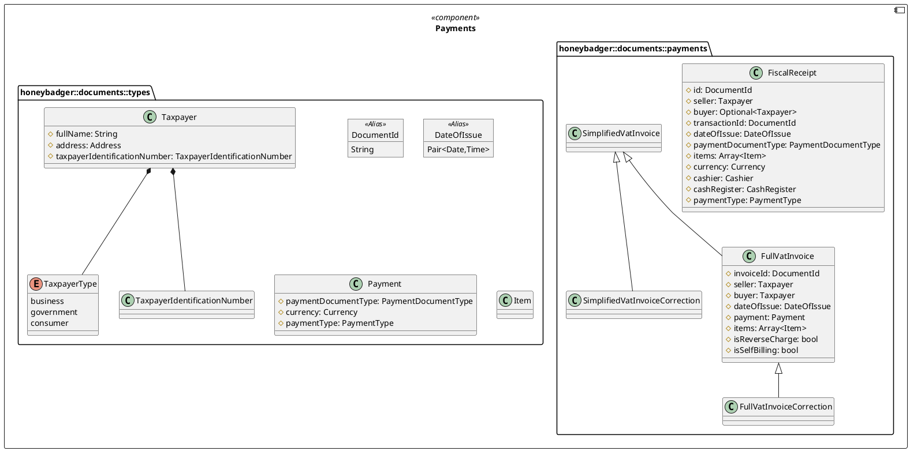

## Diagram

```plantuml
@startuml
component "Payments" as alias <<component>> {
   namespace honeybadger::documents::payments {
        class FiscalReceipt {
            # id: DocumentId
            # seller: Taxpayer
            # buyer: Optional<Taxpayer>
            # transactionId: DocumentId
            # dateOfIssue: DateOfIssue
            # paymentDocumentType: PaymentDocumentType
            # items: Array<Item>
            # currency: Currency
            # cashier: Cashier
            # cashRegister: CashRegister
            # paymentType: PaymentType
        }

        class SimplifiedVatInvoice {
        }
        class SimplifiedVatInvoiceCorrection {
        }
        class FullVatInvoice {
            # invoiceId: DocumentId
            # seller: Taxpayer
            # buyer: Taxpayer
            # dateOfIssue: DateOfIssue
            # payment: Payment
            # items: Array<Item>
            # isReverseCharge: bool
            # isSelfBilling: bool
        }
        class FullVatInvoiceCorrection {
        }

        SimplifiedVatInvoice <|-- SimplifiedVatInvoiceCorrection
        SimplifiedVatInvoice <|-- FullVatInvoice
        FullVatInvoice <|-- FullVatInvoiceCorrection
    }
    namespace honeybadger::documents::types {
        object DocumentId<<Alias>> {
            String
        }
        object DateOfIssue<<Alias>> {
            Pair<Date,Time>
        }

        class Taxpayer {
            # fullName: String
            # address: Address
            # taxpayerIdentificationNumber: TaxpayerIdentificationNumber
        }
        enum TaxpayerType {
            business
            government
            consumer
        }
        class TaxpayerIdentificationNumber {

        }
        class Payment {
            # paymentDocumentType: PaymentDocumentType
            # currency: Currency
            # paymentType: PaymentType
        }

        
        class Item {

        }
        Taxpayer *-- TaxpayerType
        Taxpayer *-- TaxpayerIdentificationNumber
    }
}
@enduml
```