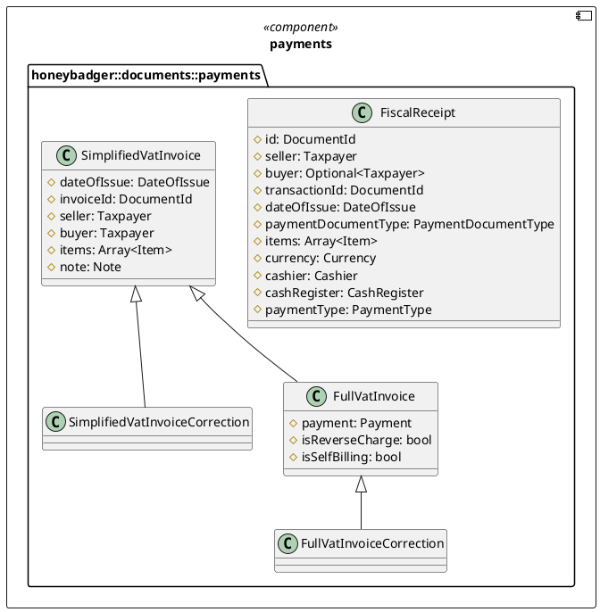

## Diagram

```plantuml
@startuml
component "payments" as alias <<component>> {
   namespace honeybadger::documents::payments {
        class FiscalReceipt {
            # id: DocumentId
            # seller: Taxpayer
            # buyer: Optional<Taxpayer>
            # transactionId: DocumentId
            # dateOfIssue: DateOfIssue
            # paymentDocumentType: PaymentDocumentType
            # items: Array<Item>
            # currency: Currency
            # cashier: Cashier
            # cashRegister: CashRegister
            # paymentType: PaymentType
        }

        class SimplifiedVatInvoice {
            # dateOfIssue: DateOfIssue
            # invoiceId: DocumentId
            # seller: Taxpayer
            # buyer: Taxpayer
            # items: Array<Item>
            # note: Note
        }
        class SimplifiedVatInvoiceCorrection {
            
        }
        class FullVatInvoice {
            # payment: Payment
            # isReverseCharge: bool
            # isSelfBilling: bool
        }
        class FullVatInvoiceCorrection {
        }

        SimplifiedVatInvoice <|-- SimplifiedVatInvoiceCorrection
        SimplifiedVatInvoice <|-- FullVatInvoice
        FullVatInvoice <|-- FullVatInvoiceCorrection
    }
}
@enduml
```