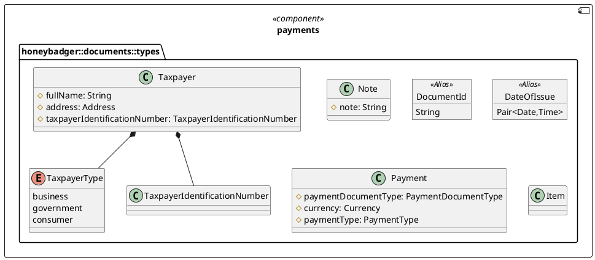

## Diagram

```plantuml
@startuml
component "payments" as alias <<component>> {
    namespace honeybadger::documents::types {
        class Note {
            # note: String
        }

        object DocumentId<<Alias>> {
            String
        }
        object DateOfIssue<<Alias>> {
            Pair<Date,Time>
        }

        class Taxpayer {
            # fullName: String
            # address: Address
            # taxpayerIdentificationNumber: TaxpayerIdentificationNumber
        }
        enum TaxpayerType {
            business
            government
            consumer
        }
        class TaxpayerIdentificationNumber {

        }
        class Payment {
            # paymentDocumentType: PaymentDocumentType
            # currency: Currency
            # paymentType: PaymentType
        }

        
        class Item {

        }
        Taxpayer *-- TaxpayerType
        Taxpayer *-- TaxpayerIdentificationNumber
    }
}
@enduml
```